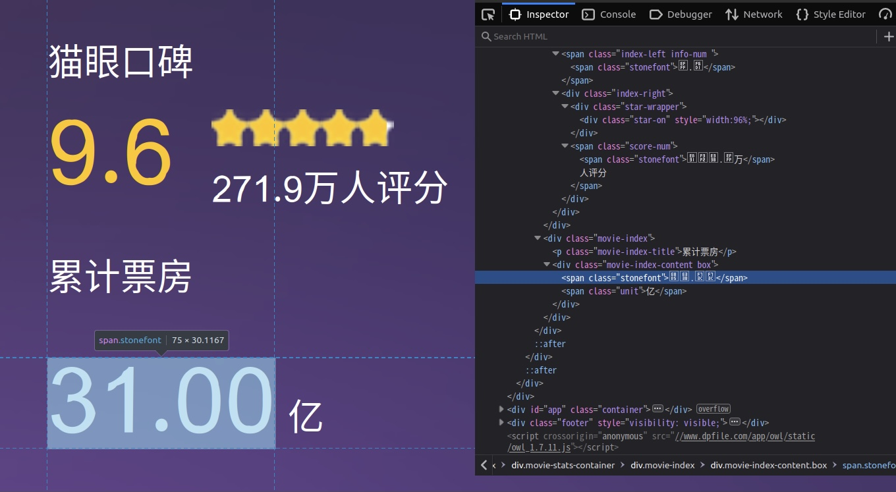

# maoyan_scraper

Selenium based scraper that scrapes the top 100 movies on [Maoyan](https://www.maoyan.com/board/4).

This scraper will first go through the top 100 rankings to obtain the links to the detail page of each movie, then visit them one by one to obtain further information. In the event that the scraper is challenged with a captcha, it will wait for the captcha to be manually solved, then resumes the scraping process.

The following information will be scraped:

1. `rank` - rank of the movie

2. `title` - name of the movie

3. `link` - link to the movie's detail page, note that the "https://www.maoyan.com" is omitted
4. `stars` - main cast of the movie
5. `rating` - rating of the movie
6. `director` - director of the movie
7. `types` - categories of the movie
8. `country/region` - country/region where the movie is produced
9. `length` - length of the movie
10. `release time` - release time of the movie
11. `release place` - release place of the movie
12. `box office (10k CNY)` - box office of the movie, in 10K CNY

### Usage

Clone this repository, then simply follow this [notebook](maoyan_scraper/scraper.ipynb).

### Maoyan number recognition

This scraper supports recognition of the anti-scraping-protected numeric fields on Maoyan.

Certain numeric fields in the movie detail pages are protected in the following way:

1. Pick some unused unicode encodings
2. Generate a font file with the glyph of 0-9, encode with the picked unicode encodings

As the result, these fields, albeit recognizable by human eyes, are actually garbled unicode, you may also notice that the font is slightly distorted:

For more details, refer to the [notebook](maoyan_scraper/scraper.ipynb). This implementation is inspired by [MaoYanFontRecognize](https://github.com/aruiplex/MaoYanFontRecognize) by [aruiplex](https://github.com/aruiplex).

